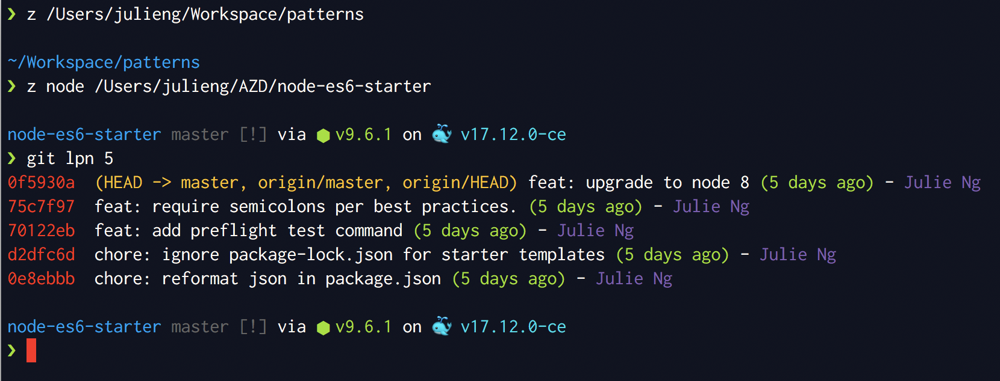

# Julie's dotfiles

Originally cloned, stripped and modified from [Paul Irish's dotfiles](https://github.com/paulirish/dotfiles/) with some further customizations.

## Install

1. Clone this repository
2. Run `./sync.sh` and confirm deletion of existing files when prompted.

## Customizations



### Powerline Fonts

https://github.com/powerline/fonts

### Color Theme - Argonaut

### VS Code Settings

### [zsh](https://github.com/robbyrussell/oh-my-zsh) 
  
I have customized **[oh-my-zsh](https://github.com/robbyrussell/oh-my-zsh)** [🚀 spaceship](https://github.com/denysdovhan/spaceship-prompt) theme to look like the [pure prompt](https://github.com/sindresorhus/pure) I previously used, but discarded because it [mangled pinentry prompts](https://github.com/sindresorhus/pure/issues/366).

### [z jumper](https://github.com/rupa/z)
  

Lets me [jump around in history without knowing/typing entire path](https://github.com/rupa/z), for example:

```bash
$ z dotfiles

# Hit Tab, Enter 
$ ~/workspace/dotfiles
```

[Install z](https://github.com/agkozak/zsh-z#installation) for zsh via

```
git clone https://github.com/agkozak/zsh-z ${ZSH_CUSTOM:-~/.oh-my-zsh/custom}/plugins/zsh-z
```

## Mac Adjustments

### Git - Disable OS X Keychain

Mac OS by default wants to use the OS X keychain. But I want to use `git-credential-netr`. 

Verify problem with

```
$ git config --system credential.helper
osxkeychain
```

Then try

```
git config --system --unset credential.helper
```

OR create a blank config to override system default:

```
touch /usr/local/etc/gitconfig
```

Yep, it's supposed to be empty.

### Big Sur 🤦‍♀️

After every tiny OS update, need to re-run:

```
xcode-select --install
```

---

## GPG Keys

Copy keys to another computer, per [gpg docs on exchanging keys](https://www.gnupg.org/gph/en/manual/x56.html).

- requires passwords for the keys
- note: this skips `--armour` flag, which creates ascii. 

#### Export Keys

```
gpg --export <user@email> --output <public.gpg>
gpg --export-secret-keys <user@email> --output <private.gpg>
```

#### Import Keys

```
gpg --import <public.gpg>
gpg --import <private.gpg>
```

#### Trust Key

If later using the key there is an erorr message that says 

> "There is no assurance this key belongs to the named user gpg:", 

then run

```
gpg --list-keys
gpg --edit-key <KEY_ID>
gpg> trust
```

and select 5

```
1 = I don't know or won't say
2 = I do NOT trust
3 = I trust marginally
4 = I trust fully
5 = I trust ultimately
m = back to the main menu
```

#### Using with `.netrc`

Use case: need to update GitHub API token.

First, decrypt the `.netrc.gpg` into `.netrc`

```
gpg --decrypt --recipient <user@email> -o .netrc .netrc.gpg
```

Make changes to `.netrc`

Then re-encrypt to a `.netrc.gpg`

```
gpg --encrypt --recipient <user@email> -o .netrc.gpg .netrc
```

Important: don't forget to delete unencrypted `.netrc` file
